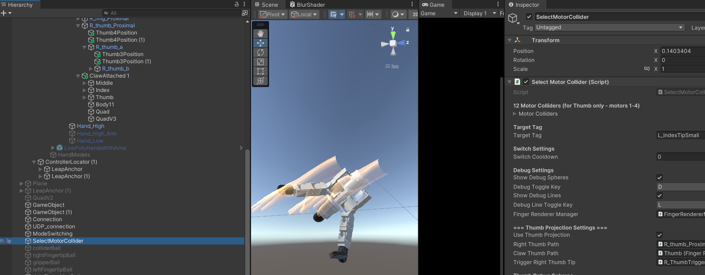
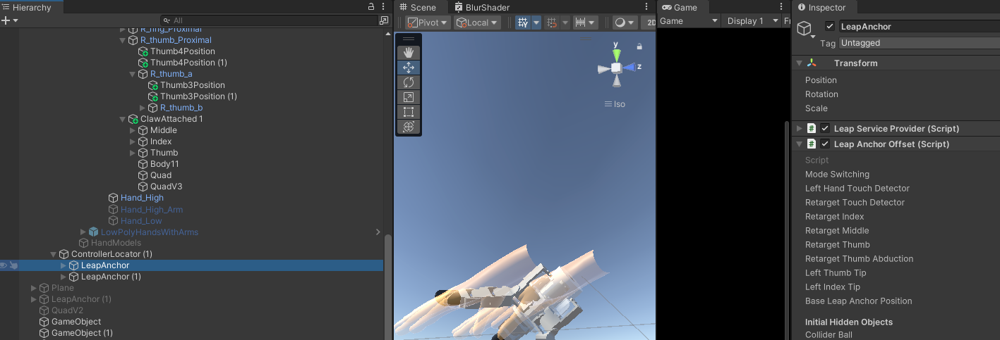
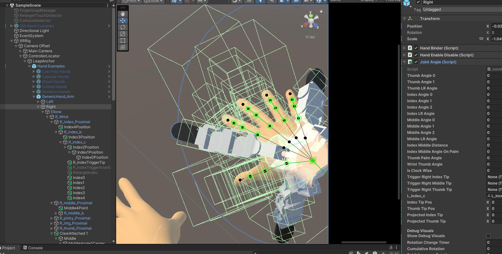

# Controlling Virtual Gripper in Unity Using Leapmotion

## Introduction

This is a project for people to control virtual gripper using their own hands in the Unity scene, and then trigger the real world's gripper to manipulate.

## Setup

### Leapmotion

You have to buy a Leapmotion2 so as to implement the project.

### Unity Scene

- Creating a 3D Unity scene first.
- Seting up with Leapmotion2
    - (How to setup Leapmotion2)[https://docs.ultraleap.com/xr-and-tabletop/xr/unity/getting-started/index.html]

### Feature

#### SelectMotorCollider

Uing this script to enable debugging lines.

#### Retargeting

Using this script to enable retargeting.

#### Clockwise/counterclockwise red line

